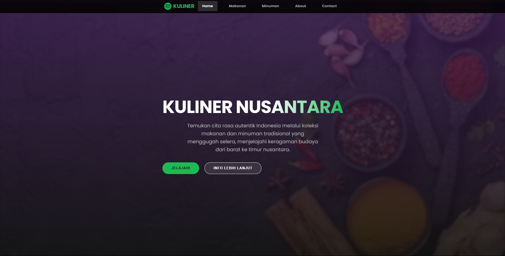
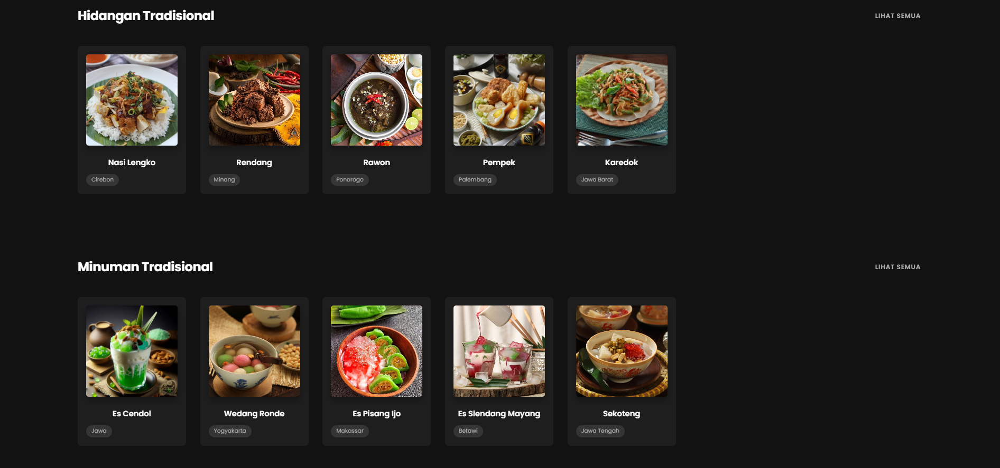
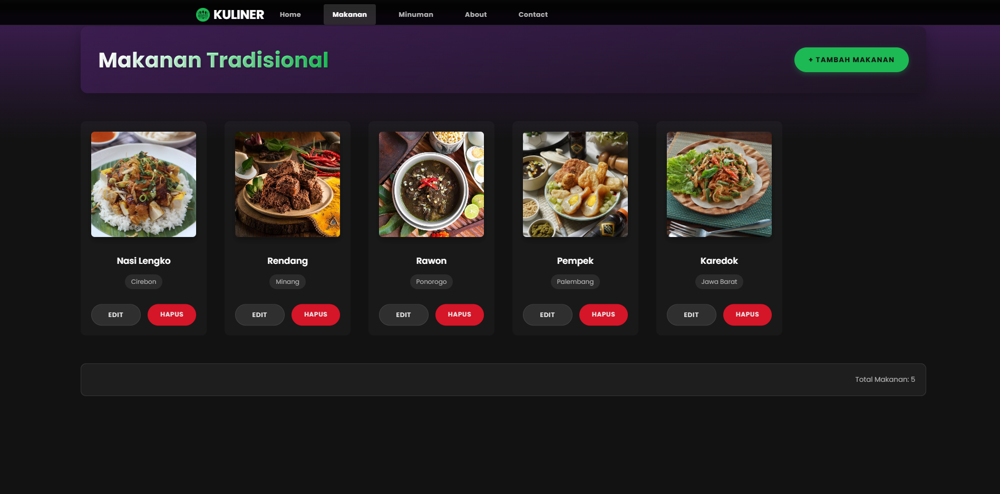
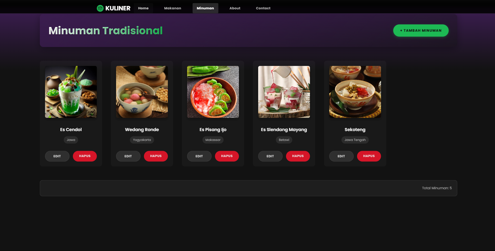
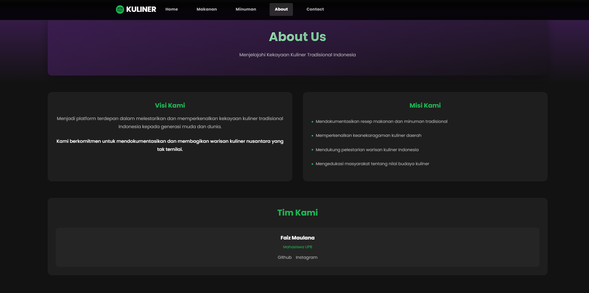
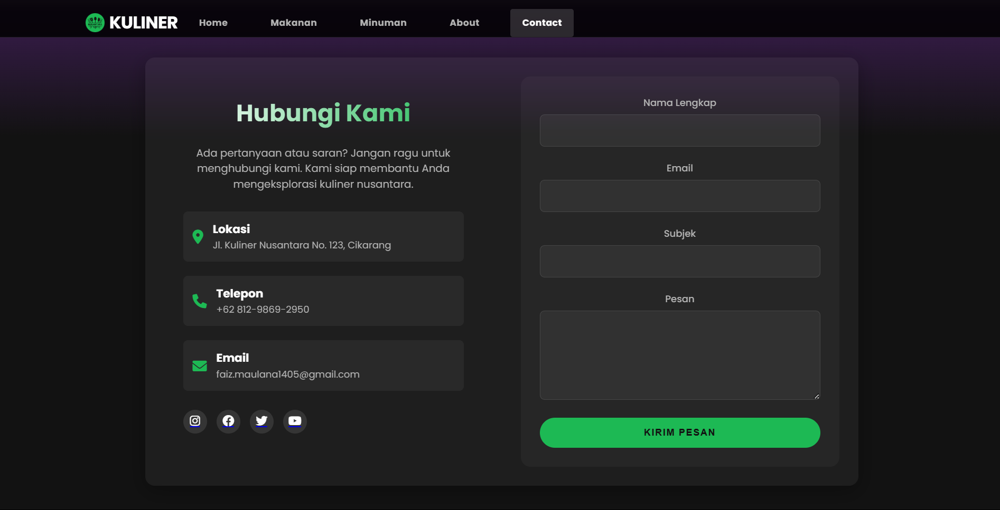
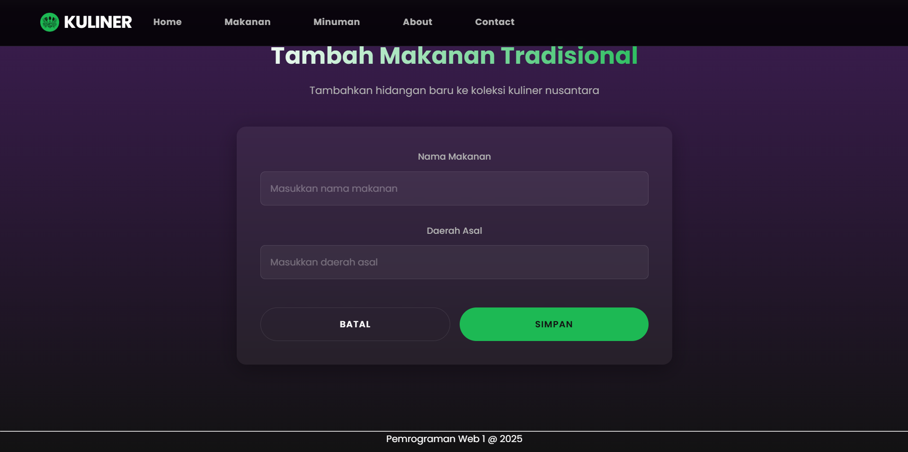
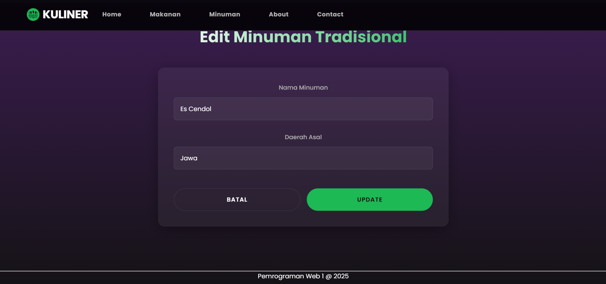
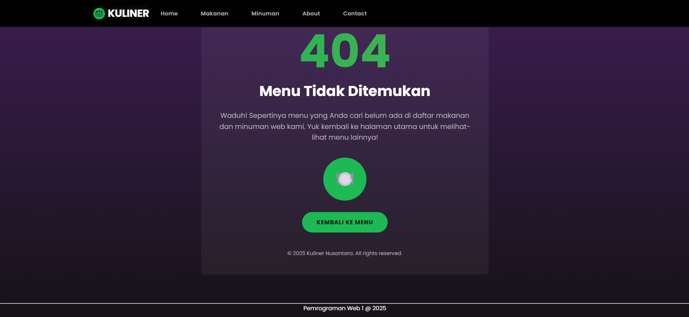

## 👤 Profil Mahasiswa

| Atribut         | Keterangan          |
| --------------- | ------------------- |
| **Nama**        | Faiz Maulana        |
| **NIM**         | 312310469           |
| **Kelas**       | TI.23.A.5           |
| **Mata Kuliah** | Pemrograman Website |

# Website Kuliner Nusantara

Selamat Datang di sebuah website yang didedikasikan untuk melestarikan dan memperkenalkan kekayaan kuliner tradisional Indonesia. Website ini bertujuan untuk mendokumentasikan dan membagikan warisan kuliner nusantara yang tak ternilai, membantu generasi muda dan dunia mengenal keberagaman masakan tradisional Indonesia dengan gaya desain yang terinspirasi dari spotify.

## Deskripsi Project
Project ini merupakan implementasi dari mata kuliah Pemrograman Web 1, dengan fokus pada pengembangan website dinamis menggunakan HTML, CSS, JavaScript, PHP, dan MySQL. Website ini menampilkan koleksi lengkap makanan dan minuman tradisional dari berbagai daerah di Indonesia.

## Tampilan Website

### 1. Halaman Home (Landing Page)

- **Header Section**
  - Logo Kuliner Nusantara di pojok kiri atas
  - Navigation bar dengan menu Home, Makanan, Minuman, About, dan Contact
  - Desain responsive yang menyesuaikan dengan ukuran layar
  
- **Hero Section**
  - Judul utama "KULINER NUSANTARA"
  - Tagline: "Temukan cita rasa autentik Indonesia melalui koleksi makanan dan minuman tradisional yang menggugah selera, menjelajahi keragaman budaya dari barat ke timur nusantara."
  - Dua tombol CTA (Call-to-Action):
    1. "JELAJAHI" - untuk langsung melihat koleksi makanan
    2. "INFO LEBIH LANJUT" - mengarah ke halaman About
  - Background dengan efek overlay berwarna ungu gelap dan gambar makanan

### 2. Halaman Makanan Tradisional

- **Header Section**
  - Judul "Makanan Tradisional"
  - Tombol "+ TAMBAH MAKANAN" di pojok kanan atas
  
- **Content Section**
  - Menampilkan grid makanan tradisional (5 items per baris)
  - Setiap card makanan memiliki:
    - Gambar makanan dengan aspect ratio 1:1
    - Nama makanan (contoh: Nasi Lengko, Rendang, Rawon, dll)
    - Label daerah asal (contoh: Cirebon, Minang, Ponorogo)
    - Tombol "EDIT" dan "HAPUS"
  - Total makanan ditampilkan di bagian bawah

- **Fitur Interaktif**
  - Hover effect pada card makanan
  - Konfirmasi sebelum menghapus data
  - Form modal untuk edit dan tambah data

### 3. Halaman Minuman Tradisional

- **Header Section**
  - Judul "Minuman Tradisional"
  - Tombol "+ TAMBAH MINUMAN" di pojok kanan atas
  
- **Content Section**
  - Grid minuman tradisional (5 items per baris)
  - Setiap card minuman memiliki:
    - Gambar minuman dengan aspect ratio 1:1
    - Nama minuman (contoh: Es Cendol, Wedang Ronde, Es Pisang Ijo)
    - Label daerah asal (contoh: Jawa, Yogyakarta, Makassar)
    - Tombol "EDIT" dan "HAPUS"
  - Total minuman ditampilkan di bagian bawah

- **Fitur Interaktif**
  - Hover effect pada card minuman
  - Konfirmasi sebelum menghapus data
  - Form modal untuk edit dan tambah data

### 4. Halaman About

- **Header Section**
  - Judul "About Us"
  - Subtitle: "Menjelajahi Kekayaan Kuliner Tradisional Indonesia"

- **Visi & Misi Section**
  - **Visi Kami:**
    - Text lengkap visi organisasi
    - Komitmen untuk melestarikan kuliner tradisional
  
  - **Misi Kami:**
    - Mendokumentasikan resep makanan dan minuman tradisional
    - Memperkenalkan keanekaragaman kuliner daerah
    - Mendukung pelestarian warisan kuliner Indonesia
    - Mengedukasi masyarakat tentang nilai budaya kuliner

- **Tim Section**
  - Profil tim pengembang
  - Link ke Github dan Instagram

### 5. Halaman Contact

- **Header Section**
  - Judul "Hubungi Kami"
  - Deskripsi singkat tentang tujuan halaman kontak

- **Informasi Kontak**
  - Lokasi lengkap: Jl. Kuliner Nusantara No. 123, Cikarang
  - Nomor telepon: +62 812-9869-2950
  - Email: faiz.maulana1405@gmail.com

- **Form Kontak**
  - Field input:
    - Nama Lengkap (required)
    - Email (required, dengan validasi format)
    - Subjek
    - Pesan (textarea)
  - Tombol "KIRIM PESAN" dengan efek hover
  
- **Social Media**
  - Icon dan link ke:
    - Instagram
    - Facebook
    - Twitter
    - YouTube
  - Hover effect pada icon social media

### 6. Form Tambah/Edit Data

- **Tambah Makanan/Minuman**
  - Form input untuk data baru:
    - Nama Makanan/Minuman (required)
    - Daerah Asal (required)
  - Tombol:
    - "SIMPAN" - menyimpan data ke database
    - "BATAL" - membatalkan input

- **Edit Makanan/Minuman**
  - Form yang sudah terisi dengan data existing
  - Validasi input sebelum update
  - Konfirmasi sebelum menyimpan perubahan

### 7. Halaman 404 (Error Page)

- **Error Message**
  - Angka "404" yang besar
  - Pesan "Menu Tidak Ditemukan"
  - Deskripsi: "Waduh! Sepertinya menu yang Anda cari belum ada di daftar makanan dan minuman web kami. Yuk kembali ke halaman utama untuk melihat-lihat menu lainnya!"
  
- **Navigation**
  - Tombol "KEMBALI KE MENU"
  - Link ke halaman utama

## Spesifikasi Teknis

### Frontend
- **HTML5**
  - Semantic HTML elements
  - Responsive meta tags
  - Form validation
  
- **CSS3**
  - Flexbox dan Grid layout
  - Custom properties
  - Media queries untuk responsive design
  - Animations dan transitions
  
- **JavaScript**
  - DOM manipulation
  - Event handling
  - Form validation
  - AJAX requests

### Backend
- **PHP**
  - Object-Oriented Programming
  - Database connection handling
  - CRUD operations
  - Form processing
  
- **MySQL Database**
  - Tabel untuk makanan dan minuman
  - Relational database design
  - Optimized queries

### Fitur Keamanan
- Input validation
- SQL injection prevention
- XSS protection
- CSRF protection

## Fitur Utama
1. **Manajemen Data Kuliner**
   - Create: Tambah makanan dan minuman baru
   - Read: Tampilkan semua data kuliner
   - Update: Edit informasi kuliner
   - Delete: Hapus data kuliner

2. **User Interface**
   - Responsive design untuk semua ukuran layar
   - Intuitive navigation
   - Interactive elements
   - Clean dan modern design

3. **Sistem Kategori**
   - Pembagian makanan dan minuman
   - Kategorisasi berdasarkan daerah asal

4. **Form Kontak**
   - Input validation
   - Email notification
   - Response feedback

Fitur CSS utama:

- Penggunaan flexbox untuk layout sentris
- Text-shadow untuk efek visual pada teks
- Border-radius dan box-shadow untuk styling gambar
- Media queries untuk responsivitas pada perangkat mobile

## Teknologi yang Digunakan

- PHP 7.4+
- MySQL 5.7+
- HTML5
- CSS3 (dengan variabel CSS untuk tema)
- JavaScript (ES6+)
- Font Awesome untuk ikon
- Google Fonts (Bebas Neue dan Poppins)

## Kontributor
- **Nama**          : Faiz Maulana   
- **NIM**           : 312310469
- **Kelas**         : TI.23.A5
- **Mata Kuliah**   : Pemrograman Web 1
- **Dosen Pengampu**: Eko Budiarto, S.Kom., M.M.

## Lisensi
© 2025 Kuliner Nusantara. All rights reserved.
